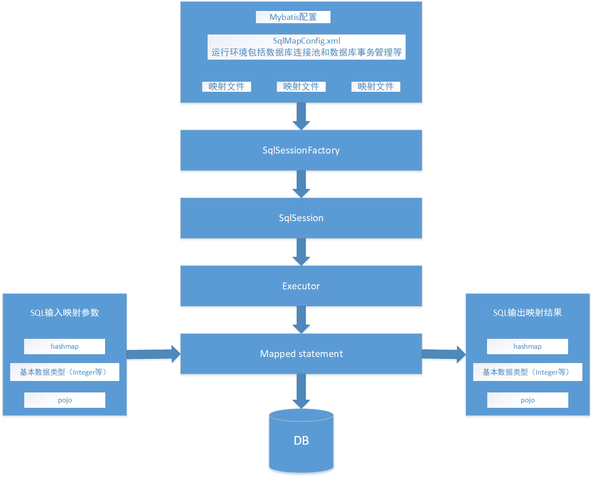

_本篇主要是对之前学过的mybatis复习与总结_
#### Mybatis介绍
_简单介绍一下，想了解详细的可以去[官网](http://www.mybatis.org/)看介绍_

MyBatis 本是apache的一个开源项目iBatis, 2010年这个项目由apache software foundation 迁移到了google code，并且改名为MyBatis，实质上Mybatis对ibatis进行一些改进。 

MyBatis是一个优秀的持久层框架，它对jdbc的操作数据库的过程进行封装，使开发者只需要关注 SQL 本身，而不需要花费精力去处理例如注册驱动、创建connection、创建statement、手动设置参数、结果集检索等jdbc繁杂的过程代码。

Mybatis通过xml或注解的方式将要执行的各种statement（statement、preparedStatemnt、CallableStatement）配置起来，并通过java对象和statement中的sql进行映射生成最终执行的sql语句，最后由mybatis框架执行sql并将结果映射成java对象并返回。
#### Mybatis架构
其具体架构图如下图所示，共分为7个组件：
+ 1、mybatis配置
  SqlMapConfig.xml，此文件作为mybatis的全局配置文件，配置了mybatis的运行环境等信息。
  mapper.xml文件即sql映射文件，文件中配置了操作数据库的sql语句。此文件需要在SqlMapConfig.xml中加载。
+ 2、通过mybatis环境等配置信息构造SqlSessionFactory会话工厂
+ 3、由会话工厂创建SqlSession会话，对数据库操作需要通过SqlSession进行。
+ 4、mybatis底层自定义了Executor执行器接口操作数据库，Executor接口有两个实现，一个是基本执行器、一个是缓存执行器，其作用：sqlsession内部通过执行器操作数据库。
+ 5、Mapped Statement也是mybatis一个底层封装对象，它包装了mybatis配置信息及sql映射信息等。mapper.xml文件中一个sql对应一个Mapped Statement对象，sql的id即是Mapped statement的id。
+ 6、Mapped Statement对sql执行输入参数进行定义，包括HashMap、基本类型、pojo，Executor通过Mapped Statement在执行sql前将输入的java对象映射至sql中，输入参数映射就是jdbc编程中对preparedStatement设置参数。
+ 7、Mapped Statement对sql执行输出结果进行定义，包括HashMap、基本类型、pojo，Executor通过Mapped Statement在执行sql后将输出结果映射至java对象中，输出结果映射过程相当于jdbc编程中对结果的解析处理过程。
  
#### Mybatis、原生JDBC、Hibernate比较
__JDBC实现过程__
1、加载数据库驱动
2、创建并获取数据库链接
3、创建jdbc statement对象
4、设置sql语句
5、设置sql语句中的参数(使用preparedStatement)
6、通过statement执行sql并获取结果
7、对sql执行结果进行解析处理
8、释放资源(resultSet、preparedstatement、connection)，注意遵循顺序释放。

如下代码所示：
```java
/**  
 * @Title: JDBCInstance.java
 * @Package com.jdbc
 * @author Zhao Qian
 */
package com.jdbc;

import java.sql.Connection;
import java.sql.DriverManager;
import java.sql.PreparedStatement;
import java.sql.ResultSet;
import java.sql.SQLException;

/**
 * @author Zhao Qian
 * @date 2018年12月4日
 * @version 1.0
 */
public class JDBCInstance {

	/**
	 * 原生jdbc操作数据库
	 * @param args  
	 * @throws
	 * @author Zhao Qian
	 * @date 2018年12月4日
	 */
	public static void main(String[] args) {
		Connection connection =null;
		PreparedStatement preparedStatement = null;
		ResultSet resultSet = null;
		
		try {
			Class.forName("com.mysql.jdbc.Driver");
			connection = DriverManager.getConnection("jdbc:mysql://localhost:3306/mybatis?characterEncoding=utf-8","root","root");
			String sql = "select * from user where userName = ?";
			preparedStatement = connection.prepareStatement(sql);
			//设置参数，第一个参数为sql语句中参数的序号（从1开始），第二个参数为设置的参数值
			preparedStatement.setString(1, "zhao");
			resultSet = preparedStatement.executeQuery();
			while(resultSet.next()) {
				System.out.println(resultSet.getString("id")+"  "+resultSet.getString("userName"));
			}
		} catch (ClassNotFoundException e) {
			// TODO Auto-generated catch block
			e.printStackTrace();
		} catch (SQLException e) {
			// TODO Auto-generated catch block
			e.printStackTrace();
		}finally {
			if(resultSet != null) {
				try {
					resultSet.close();
				} catch (SQLException e) {
					// TODO Auto-generated catch block
					e.printStackTrace();
				}
			}
			if(preparedStatement != null) {
				try {
					preparedStatement.close();
				} catch (SQLException e) {
					// TODO Auto-generated catch block
					e.printStackTrace();
				}
			}
			if(connection != null) {
				try {
					connection.close();
				} catch (SQLException e) {
					// TODO Auto-generated catch block
					e.printStackTrace();
				}
			}
		}

	}

}

```
__上述JDBC实现的问题__
+ 数据库链接创建、释放频繁造成系统资源浪费从而影响系统性能，如果使用数据库链接池可解决此问题。
+ Sql语句在代码中硬编码（一次性编码，不灵活），造成代码不易维护，实际应用sql变化的可能较大，sql变动需要改变java代码。
+ 使用preparedStatement向占有位符号传参数存在硬编码，因为sql语句的where条件不一定，可能多也可能少，修改sql还要修改代码，系统不易维护。
+ 对结果集解析存在硬编码（查询列名），sql变化导致解析代码变化，系统不易维护，如果能将数据库记录封装成pojo对象解析比较方便。

以上问题在mybatis中的解决方式如下：
1、在SqlMapConfig.xml中配置数据链接池，使用连接池管理数据库链接。
2、将Sql语句配置在XXXXmapper.xml文件中与java代码分离。
3、Mybatis自动将java对象映射至sql语句，通过statement中的parameterType定义输入参数的类型。
4、Mybatis自动将sql执行结果映射至java对象，通过statement中的resultType定义输出结果的类型。

__Hinernate与Mybatis区别__
Mybatis和hibernate不同，它不完全是一个ORM框架，因为MyBatis需要程序员自己编写Sql语句，不过mybatis可以通过XML或注解方式灵活配置要运行的sql语句，并将java对象和sql语句映射生成最终执行的sql，最后将sql执行的结果再映射生成java对象。

Mybatis学习门槛低，简单易学，程序员直接编写原生态sql，可严格控制sql执行性能，灵活度高，非常适合对关系数据模型要求不高的软件开发，例如互联网软件、企业运营类软件等，因为这类软件需求变化频繁，一但需求变化要求成果输出迅速。但是灵活的前提是mybatis无法做到数据库无关性，如果需要实现支持多种数据库的软件则需要自定义多套sql映射文件，工作量大。

Hibernate对象/关系映射能力强，数据库无关性好，对于关系模型要求高的软件（例如需求固定的定制化软件）如果用hibernate开发可以节省很多代码，提高效率。但是Hibernate的学习门槛高，要精通门槛更高，而且怎么设计O/R映射，在性能和对象模型之间如何权衡，以及怎样用好Hibernate需要具有很强的经验和能力才行。

_说明_：mybatis与hibernate框架无好坏之分，按照用户的需求在有限的资源环境下只要能做出维护性、扩展性良好的软件架构都是好架构，所以框架只有适合才是最好。 